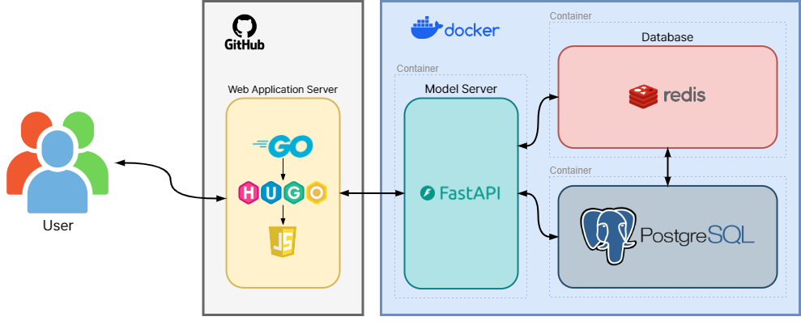
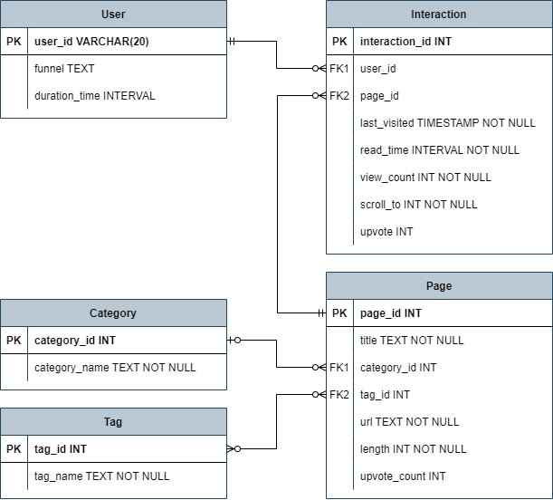

# Hugo Recommendation Blog

깃허브 기술 블로그에 게시글 개인화 추천 기능을 추가하는 프로젝트

# blog Architecture

## Web Application Server

**Github + Hugo**

1. 익명 방문자에게 임의의 id를 부여한 후 방문자의 Chrome Local Storage에 id 저장
2. 저장된 id를 통해 구분되는 익명 방문자의 Implicit feedback을 수집하여 서버로 전송
3. DB에 저장된 사용자 상호 작용 정보와 아이템(게시글) 정보를 바탕으로 새로운 게시글 추천

## Backend

1. 요청으로 넘어온 implicit feedback을 DB에 저장
2. DB에 저장된 상호작용 정보와, 게시글 정보를 가져오기
3. DB에서 가져온 정보를 모델에 주입한 후 게시글 추천 결과 생성

### Model

- 협업 필터링 모델 — 상호작용 정보 활용
- 콘텐츠 기반 추천 모델 — 게시글 정보 활용

## DB Schema

